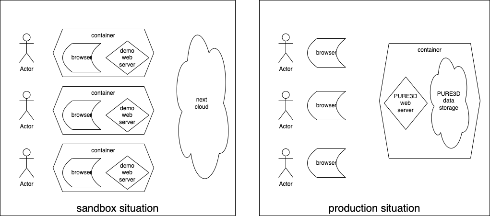
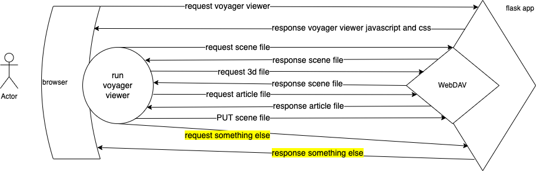

# Move from n sandboxes to 1 webserver

In the sandbox situation, each user got a separate application in which a voyager demo server was set up.
In the new situation, there is one server, which serves the voyager viewer to all users.
Some key differences

sandbox | webserver
--- | ---
1 user per installed application | the application can serve 1000s of users
authorisation is not implemented and cannot be implemented | authorisation can be implemented in the webserver
additional business logic is not implemented and cannot be implemented | additional business logic can be implemented in the webserver
no embedding of voyager experience in wider context | voyager experience as part of the total experience
# Webserver
The webserver is a Python application that rests on the library *Flask*, which is a skeleton on which we develop custom behaviour.
Sohini will write a lot of code here. See [dip](../../src/dip).
# Webserver + Voyager

The hard part is to integrate Voyager in the webserver.
The easy part is to serve the Voyager viewer to the users.
The difficult part is to support the way the Voyager viewer talks back to the server.
The only thing the docs say is that it expects the server to be able to handle WebDAV requests.
We managed to weave the WebDAV protocol into an arbitrary Flask webapp.
However, we discovered a bug in the Voyager and proposed a fix that was accepted.
For other viewers, the road is expected to be bumpy for the same main reason: lack of specs.
