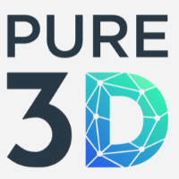

[](https://www.repostatus.org/#wip)


# How to build and run the pure3d app
By default, the app runs on port 8000

### to build:
```shell
./build.sh
```

### to run
```shell
docker compose up -d
```

### notes
 * .env should be copied manually to remote server
 * docker-compose-acc.yml should be copied manually to remote server
 * restart.sh should be copied manually to remote server
 * please add `pure3d.dev` as host alias to your ssh config, and make sure you can run sudo without password